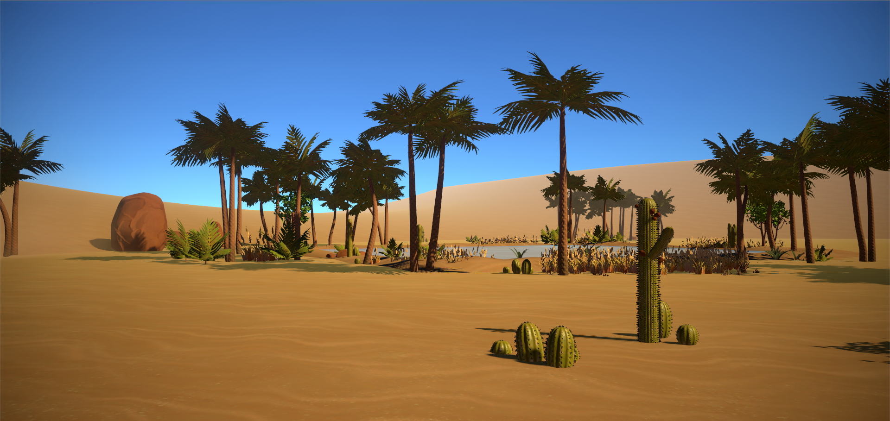
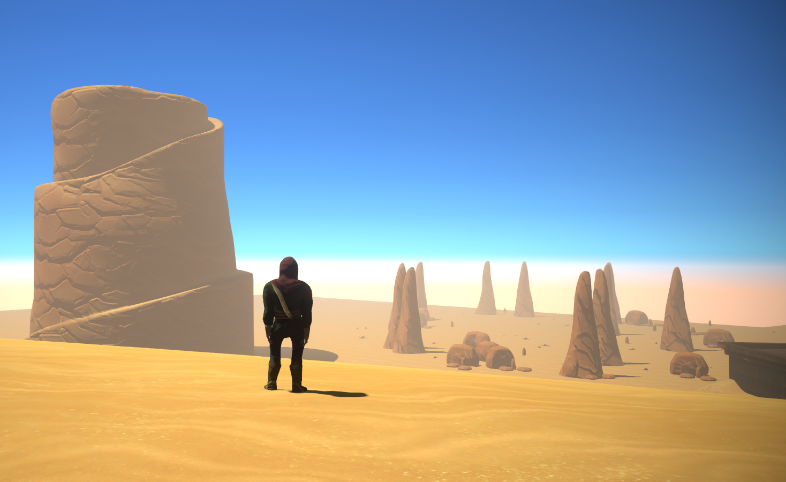
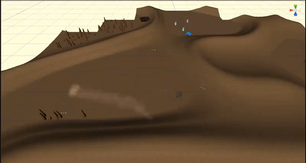

# Groasis (Survive and explore game)
The following project is a game created during the game development course at Södertörn university. The in-depth description of the game can be found in the link below. The duration of the project was 2 months. The number of developers working on this project was 8.

The game has been released on itch.io and is avalable to download for free :

Link to webside: https://443-production.itch.io/groasis 

Link to trailer: https://www.youtube.com/watch?v=9F0MWJhgrg4

# My Contribution to the project - Envoirment Generation

Generation of environment on procedurally generated meshes.The solution can be used with any number of asset combination by simply 
creating new scriptable object. [Unity]

# What have I learned

• Multithreaded operations in unity.

• Principles of procedural mesh generation (vertices manipulation)

• I expanded my knowledge on code optimization

• Poison sampling method for object generation

# Tools and methods used during the project 

• TestLink 

• Trello 

• Sprint method 

• Unity Collab

# Credits

All the credits for procedural mesh generation go to Sebastian Lague:
https://github.com/SebLague

